# FeiMaoTecPlanner V1.1.6（FMTPlanner）使用手冊

V1.1.6：請下載最新版完整 ZIP 並執行 `FMTPlanner-V1.1.6.exe`。新增 P400 設定、頻率表及參數編輯，詳見 [P400 操作說明](FMT/P400-AT-README.md)；版本差異見 [更新紀錄](CHANGELOG-FMT.md)。下方舊版操作截圖與檔名僅供介面參考。

  

**FeiMaoTecPlanner** 是由 **FMT 飛貓科技**以 ArduPilot Mission Planner 為基礎製作的客製化地面站軟體，重點包含 FMT 品牌介面、飛行快捷操作、TitanPlanner 風格姿態儀、台灣限禁航區、任務安全檢查、參數保護及繁體中文介面。

> 本手冊對應 V1.1.5。新增接力控制、MAVLink 轉發狀態與衝突檢查、導控站位置，以及實體遙控器／電腦搖桿安全切換。部分既有示意圖沿用前版；實際版本以視窗標題為準。

## 目錄

- [主要更動與介面樣式](#主要更動與介面樣式)
- [下載、啟動與登入](#下載啟動與登入)
- [主畫面導覽](#主畫面導覽)
- [連線飛控](#連線飛控)
- [MQTT 橋接與數傳設定](#mqtt-橋接與數傳設定)
- [接力控制與控制來源切換](#接力控制與控制來源切換)
- [解鎖與上鎖](#解鎖與上鎖)
- [空速計歸零](#空速計歸零)
- [QNH 海平面氣壓校正](#qnh-海平面氣壓校正)
- [GPS 狀態](#gps-狀態)
- [任務規劃與航點距離](#任務規劃與航點距離)
- [限禁航區與任務檢查](#限禁航區與任務檢查)
- [訊息顏色](#訊息顏色)
- [參數頁面與密碼](#參數頁面與密碼)
- [GitHub 錯誤回報](#github-錯誤回報)
- [常見問題](#常見問題)
- [安全注意事項](#安全注意事項)

## 主要更動與介面樣式

| 項目 | FMTPlanner 更動 |
|---|---|
| 品牌 | 軟體名稱改為 `FeiMaoTecPlanner`，加入 FMT Logo、圖示及官網連結 |
| 主題 | 固定使用 FMT 天空藍深色主題，減少不同主題造成的文字可讀性問題 |
| 語言 | 預設英文；中文介面採繁體中文與台灣用語，不顯示簡體中文選項 |
| 姿態儀 | 採用 TitanPlanner 風格配置，集中顯示姿態、航向、速度、高度及解鎖狀態 |
| 飛行模式 | HUD 與資訊列之間顯示常用模式按鈕，依多旋翼、定翼機、VTOL、車／船或潛航器自動切換 |
| AUTO 任務 | 地圖上方顯示任務狀態、目前／下一 Mission Item、進度與 ETA；任務數量變更會立即刷新，進度依實際清單位置計算；執行前仍須由操作者確認任務及飛控狀態 |
| 設定頁 | 遙控器校正、馬達測試與舵機輸出採 TitanPlanner 風格重新配置，保留原安全流程 |
| 地圖飛行器 | 定翼機、多旋翼及 VTOL 使用專用頂視圖；目前使用中的飛行器加上天空藍背光 |
| 遙測中文 | 欄位選擇視窗、儀表板指標、單位與分頁採繁體中文，底層 MAVLink 鍵值保持相容 |
| 快捷操作 | 工具列加入解鎖／上鎖、空速計歸零及 QNH 校正按鈕 |
| 接力控制 | 地圖上方整合站台控制權、MAVLink 轉發、本機搖桿與導控站位置；轉發狀態與端點衝突會明確提示 |
| 控制來源 | 工具列提供實體遙控器／導控搖桿切換，程式啟動及重新連線預設使用實體遙控器 |
| GPS | 工具列右側顯示衛星數量、定位型態、HDOP 與 VDOP |
| 任務規劃 | 地圖顯示相鄰航點距離；拖曳航點時，點位與航線會跟隨滑鼠更新 |
| 空域 | 依台灣民航局資料顯示禁航區（紅色）與限航區（黃色） |
| 任務檢查 | 加入高度檢查及限禁航區檢查，涵蓋起飛、航點間與返航路徑 |
| 訊息 | 依嚴重程度使用紅、黃、藍、綠及一般樣式呈現 |
| 參數保護 | 主工具列提供獨立「參數設定」頁面，集中管理完整參數列表及密碼變更功能 |
| 精簡介面 | 移除模擬器、說明／關於頁面及初始配置中的選配硬體模組頁面 |
| 穩定版清理 | 外掛空目錄不再建立無效工作；修正重複事件與 Theme 套用；更新視窗改為 UTF-8 可捲動介面；Windows ZIP 排除偵錯與非 Windows 檔案 |
| 錯誤回報 | 移除原第三方 HTTP 自動回報；改為本機預覽、去識別化並由使用者自行送出 GitHub Issue |

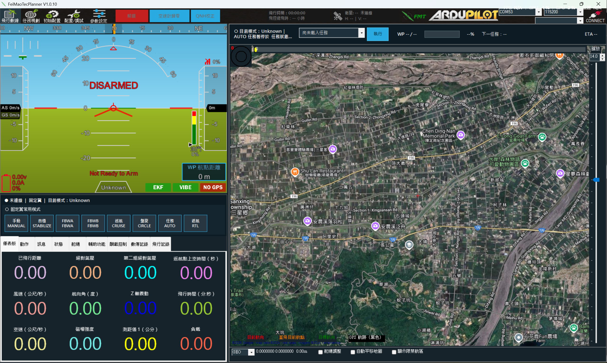

主畫面左側為 TitanPlanner 風格姿態儀與資料區，右側為地圖及台灣限禁航區圖層；上方提供飛行快捷按鈕、GPS 狀態、FMT Logo、連線埠與傳輸速率。

## 下載、啟動與登入

### 啟動畫面

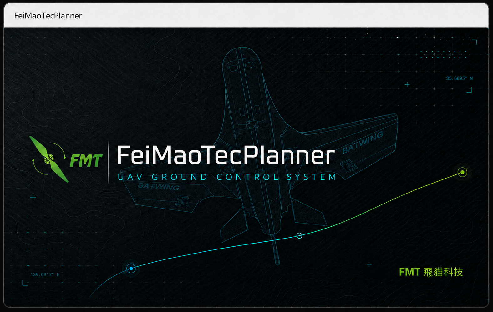

### 登入畫面

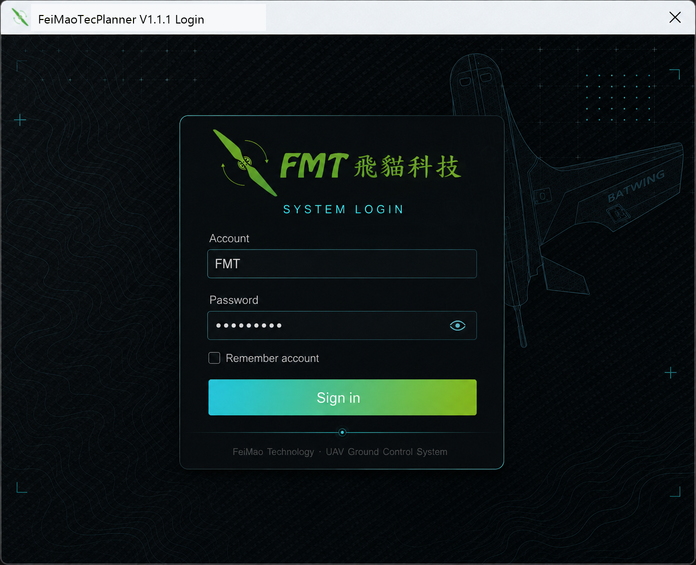

1. 到 GitHub 專案右側的 **Releases／發布**下載最新版 `FMTPlanner-VX.X.X.zip`。
2. 將 ZIP 完整解壓縮到可寫入的資料夾，不要直接在壓縮檔內執行。
3. 執行解壓縮後的 `FMTPlanner-V1.1.5.exe`。
4. 在登入畫面輸入預設帳號與密碼：

   - 帳號：`FMT`
   - 密碼：`1234`

5. 登入後才會進入主程式。

> 正式使用前應變更預設密碼。FMTPlanner 是可攜式程式，正常啟動時不會另外顯示命令提示字元視窗。

## MQTT 橋接與數傳設定

- 在地圖下方勾選「MQTT 連線」，設定自己的 Broker／TLS／Client ID／帳密與上下行 Topic，再啟動橋接。同機 MP 透過 TCP 連線至面板提示的 `127.0.0.1` 與埠號（預設 8080）。收合面板不會停止橋接；請使用「停止橋接」。詳見 [MQTT 操作說明](FMT/MQTT-EMBEDDED.md)。
- 橋接啟動後，工具列飛行時間左側顯示接收／傳送速度；有轉速計時排列為「轉速計 → MQTT → 飛行時間」。這些數值不代表飛控 MAVLink 已就緒。
- 任一 MP 遙測連線或 MQTT 橋接執行中，關閉主視窗會先確認，預設「否」。強制結束、關機或斷電不受此提示保護。
- 「初始設置 → RTK 下方 → 數傳設定」提供中文 SiK 本機／遠端設定。先中斷 MP 飛行連線，明確選擇 COM 與鮑率後讀取；寫入、恢復預設與韌體更新仍需確認。詳見 [SiK 操作說明](FMT/SIK-SETTINGS.md)。
- 「動作」分頁已中文化，保留原命令值；原本標示「手動」但執行 Loiter 的按鈕改標示「定點盤旋」。速度／高度／盤旋半徑欄位固定同列，視窗過窄時捲動查看。

發布檔不包含個人 Broker 帳密、VM 管理資料或手機 App。`.fmt` 不含 MQTT 密碼；請在本機重新輸入並自行選擇是否安全記住。

## 接力控制與控制來源切換

- 勾選地圖下方的「接力控制」後，面板會顯示站台與控制權、MAVLink 轉發及本機搖桿設定；面板與 3D 地圖、MQTT、安全設定共用地圖上方區域，避免互相重疊。
- MAVLink 轉發列會顯示停用、運作或錯誤狀態，並在啟動前檢查重複 IP／Port、本機接收埠占用及無效端點。VPN、防火牆與遠端站實際可達性仍須由現場測試確認。
- Windows 能提供定位時，地圖顯示本機及已收到的接力站位置與站號；沒有有效定位就不顯示。這些標記不會改寫飛機 HOME 點。
- 工具列 QNH 右側的控制來源開關啟動時預設為「遙控器控制」。只有本機搖桿已建立並啟用時，才開放切換為「導控控制」。
- 切到導控控制前會要求搖桿軸值與目前 RC 狀態對齊並保持穩定；飛行器已解鎖時不會由程式自動改變控制來源。
- 程式會檢查 `RC1_OPTION`～`RC18_OPTION` 的關鍵開關。解鎖、緊急停槳、馬達互鎖等可由導控按鈕執行，不要求在電腦搖桿重複綁定；切回實體遙控器時仍必須依畫面清單人工確認開關位置。

> 目前標準 MAVLink 遙測不保證能在導控控制期間持續取得被隔離實體接收機的原始開關位置，因此回切遙控器採人工確認，不應宣稱為全自動無縫交接。接力控制及 VPN 轉發正式使用前，必須在拆槳或無動力的地面安全狀態完成端到端驗證。

## 主畫面導覽

上方主要頁面由左至右為：

1. **飛行數據（DATA）**：姿態、即時遙測、地圖、訊息及飛行操作。
2. **任務規劃（PLAN）**：建立航點、設定高度、檢查任務及上傳任務。
3. **初始配置（SETUP）**：必要的飛控初始設定。
4. **配置／調試（CONFIG）**：常用調校、OSD、MAVFTP、使用者參數與規劃器設定。
5. **參數設定**：輸入參數密碼後進入完整參數列表，並可在此變更參數密碼。

工具列快捷操作由左至右為：

1. **解鎖／上鎖**
2. **空速計歸零**
3. **QNH 校正**

右側 FMT Logo 可點擊開啟 [FMT 飛貓科技官網](https://www.feimaotec.com)。

### 常用飛行模式

HUD 下方會顯示目前連線構型與模式。可用按鈕由飛控回報的模式清單決定，無法使用的模式會停用；點擊切換前仍會執行連線、解鎖狀態與模式支援檢查。VTOL／QuadPlane 同時顯示 Q 模式與固定翼模式，車／船及潛航器則使用各自的常用模式。

### 儀表板與遙測欄位

在「儀表板」數值方框上按兩下可開啟「選擇顯示項目」。V1.0.5 將加速度、氣壓、電池、ESC、GPS、測距儀、通道輸入／輸出、飛行時間、空速、風速、航向及返航點距離等可見名稱改為繁體中文。畫面只翻譯顯示文字，儲存設定所使用的 CurrentState 屬性名稱不會改變。

### 飛行模式頁常用設定

在「初始配置 → 飛行模式設定」下方提供三個獨立方框，並依連線飛控自動啟用對應構型：

- **多旋翼**：導航速度、GPS 定位速度、WP 接受半徑、WP 航向、RTL 航向及 RTL 速度。WP 航向與 RTL 航向在畫面中分開選擇，但會安全映射至飛控共用的 `WP_YAW_BEHAVIOR`。
- **定翼機**：巡航／RTL 目標空速、最低 GPS 地速與 WP 接受半徑；WP／RTL 航向由定翼機航線控制，不寫入多旋翼的航向參數。
- **VTOL／QuadPlane**：定翼巡航空速、VTOL 導航／返航速度、VTOL GPS 速度、VTOL WP 接受半徑與中文 QRTL 返航模式。

速度一律以 `m/s` 顯示，WP 半徑一律以公尺 `m` 顯示。程式會依飛控版本自動對應新舊參數，並處理舊版 `cm/s`、`cm` 換算；每個方框都有中文用途說明，非目前連線構型的方框仍會顯示但保持停用，避免跨構型誤寫參數。

## 連線飛控

1. 使用 USB、遙測電台或其他支援的通訊方式連接飛控。
2. 在右上角選擇正確的 COM 埠。
3. 選擇傳輸速率；請依設備設定，常見值為 `57600` 或 `115200`。
4. 按下 **CONNECT／連線**。
5. 等待參數讀取完成，再進行校正、任務上傳或參數修改。

若無法連線，請依序確認 Windows 裝置管理員中的 COM 埠、傳輸速率、USB 線材、遙測模組電源，以及 COM 埠是否已被其他程式占用。

## 解鎖與上鎖

工具列紅色按鈕會依飛機狀態切換：

- 未解鎖時顯示 **解鎖／ARM**。
- 已解鎖時顯示 **上鎖／DISARM**。
- 按鈕連動「飛行數據 → 動作」中的原有解鎖／上鎖流程，因此仍保留飛控安全檢查與確認提示。

若姿態儀顯示 **Not Ready to Arm**，可點擊該狀態查看未符合的解鎖條件。不要在未排除原因前使用強制解鎖。

## 空速計歸零

空速計歸零只在飛控已連線、飛機上鎖且地面靜止時開放。

1. 確認飛機已上鎖，螺旋槳區域無人員及障礙物。
2. 保持飛機靜止，鬆散遮住空速管，避免風吹影響零點；不要密封或對空速管施壓。
3. 按下 **空速計歸零／ZERO AIRSPEED**。
4. 閱讀警告並確認執行。
5. 等待飛控回傳校正完成訊息。

此操作只送出空速感測器校正命令，不會執行其他感測器校正。

## QNH 海平面氣壓校正

QNH 用來設定當地換算到平均海平面的氣壓，使氣壓高度基準符合當地氣象資料。此按鈕位於「空速計歸零」右側，只在飛控已連線、飛機上鎖時開放。

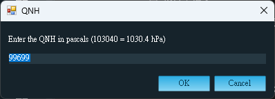

操作方式：

1. 從當地機場 ATIS、METAR 或可信任的氣象資料取得 QNH。
2. 按下 **QNH 校正／QNH**。
3. 以 **hPa（百帕）**直接輸入數值：

   - 標準氣壓可輸入 `1013.25`
   - 當地 QNH 為 `996.99 hPa` 時輸入 `996.99`

4. FMTPlanner 接受 `800～1100 hPa`，超出範圍或非數字輸入會被拒絕；寫入飛控時會自動換算成飛控參數所需單位。
5. 確認換算後數值及高度基準變更警告，再寫入飛控。

部分新版 ArduPilot 韌體會將 `BARO1_GND_PRESS` 設為唯讀。遇到飛控拒絕時，FMTPlanner 會顯示錯誤；請勿以強制方式覆寫唯讀參數。

## GPS 狀態

工具列右側顯示兩行 GPS 資訊：

- **衛星數量／Sats**：目前使用或可見的衛星數量。
- **定位型態**：No Fix、2D、3D、DGPS、RTK Float、RTK Fixed 等。
- **H**：HDOP，水平定位精度稀釋值。
- **V**：VDOP，垂直定位精度稀釋值。

DOP 數值通常越低越好，但是否可執行任務仍應依飛控 EKF、GPS 狀態、作業程序及任務需求綜合判斷，不能只看衛星數量。

## 任務規劃與航點距離

1. 進入 **任務規劃（PLAN）**。
2. 確認 Home／起始位置正確。
3. 在地圖上依序建立航點並設定命令、高度及其他任務參數。
4. 相鄰航點的直線距離會顯示在航線上，方便快速檢查航段長度。
5. 拖曳航點時，航點標記及路線會跟隨滑鼠移動；放開後才提交新位置。
6. 完成任務後先執行高度與限禁航區檢查，再按 **Write／上傳**寫入飛控。

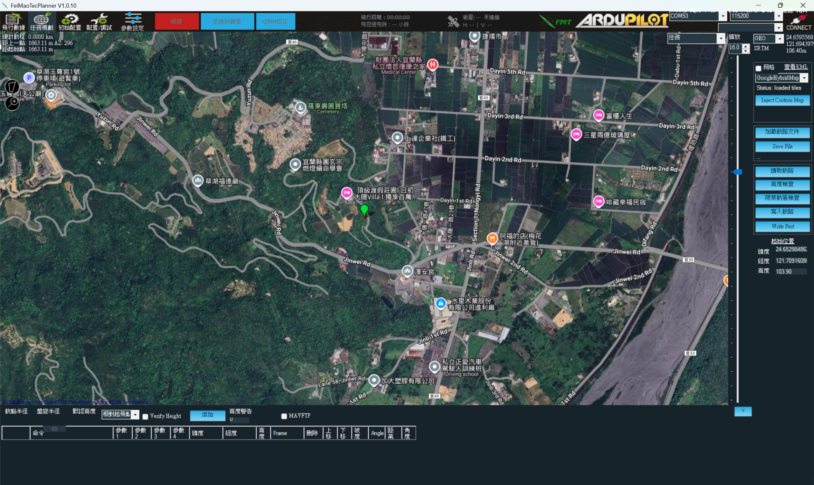

## 限禁航區與任務檢查

FMTPlanner 使用台灣民航局公開資料在地圖上呈現：

- **紅色：禁航區**
- **黃色：限航區**

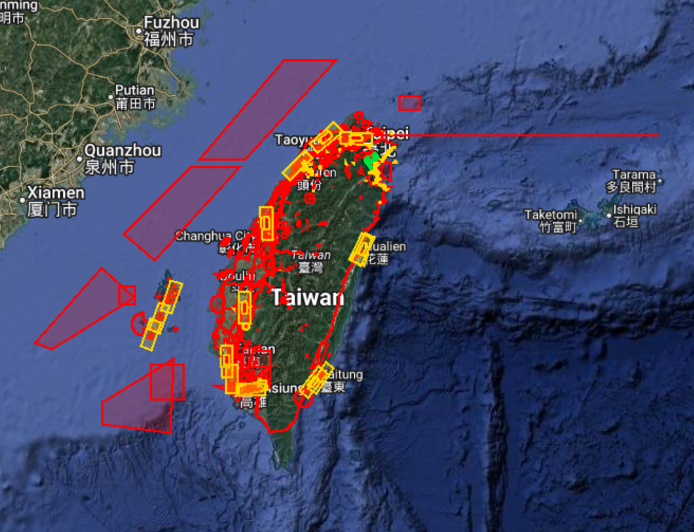

地圖只繪製飛機附近的空域資料以降低平移與縮放負擔；可使用地圖下方的 **顯示限禁航區** 選項控制圖層。

任務完成後，右側工具列提供：

### 高度檢查

- 顯示任務高度及地形剖面。
- 對低於約 30 m 的地形間距提出警告。
- 對超過台灣一般 120 m AGL 高度基準的航段提出警告。
- 結果是規劃輔助，不代表已取得超高或特別作業許可。

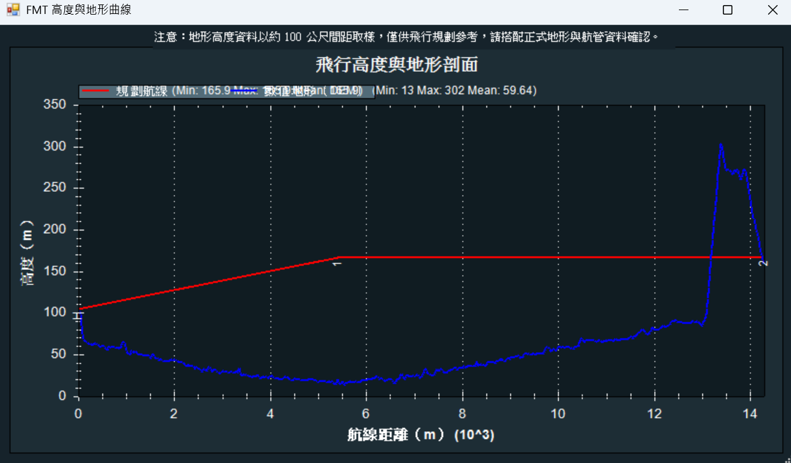

### 限禁航區檢查

檢查下列完整路徑是否進入或穿越紅色、黃色區域：

1. Home 到第一個航點的起飛路徑。
2. 所有相鄰航點間的任務路徑。
3. 最後一個航點返回 Home 的返航路徑。

若沒有有效 Home 位置，系統不會回報「安全通過」，以免漏掉起飛或返航路徑。檢查發現交會時會列出受影響的路徑；它目前是告警輔助，不會自動取代操作者的法規確認。

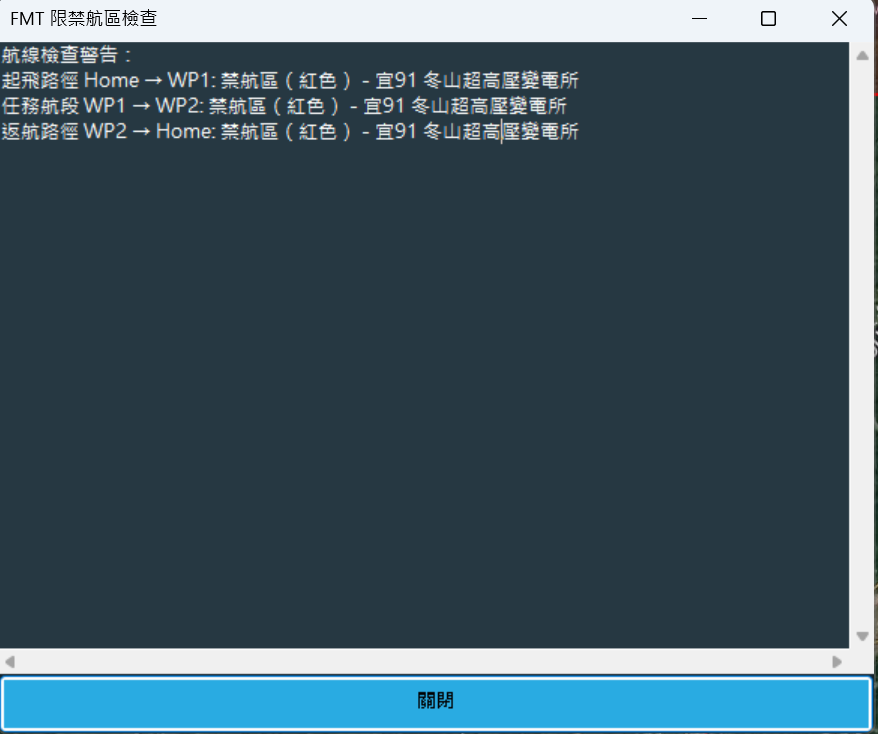

空域資料會在本機快取約 12 小時。正式作業前仍應查閱：

- [交通部民用航空局遙控無人機管理資訊系統（含空域查詢）](https://drone.caa.gov.tw/)

## 訊息顏色

訊息頁依 MAVLink 嚴重程度及內容使用不同樣式，讓重要狀態更容易辨識。

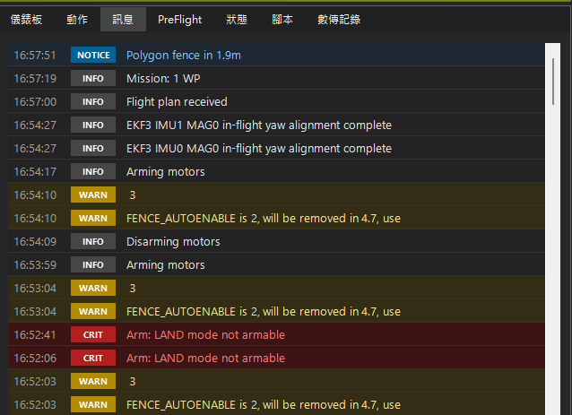

| 顏色 | 類型 | 用途 |
|---|---|---|
| 紅色 | CRIT／ERROR | 嚴重錯誤、解鎖失敗或必須立即處理的狀態 |
| 黃色 | WARN | 警告、即將棄用的參數或需要注意的飛控狀態 |
| 藍色 | NOTICE | 圍籬、任務或系統的重要通知 |
| 綠色 | SUCCESS | 可辨識的成功或完成訊息 |
| 一般深色 | INFO | 一般資訊與狀態記錄 |

紅色或黃色訊息不應只依顏色判斷，必須閱讀完整內容並處理根本原因。

## 參數頁面與密碼

完整參數頁面由獨立的「參數設定」入口管理：

1. 在主工具列點選 **參數設定**。
2. 輸入參數密碼；輸入完成後可直接按 **Enter** 解鎖。
3. 解鎖後進入 **完整參數列表**，參數儲存格可直接修改。
4. 若要修改密碼，請在「參數設定」頁面點選 **設定參數密碼**。

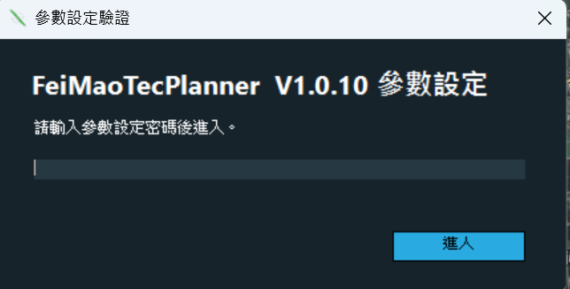

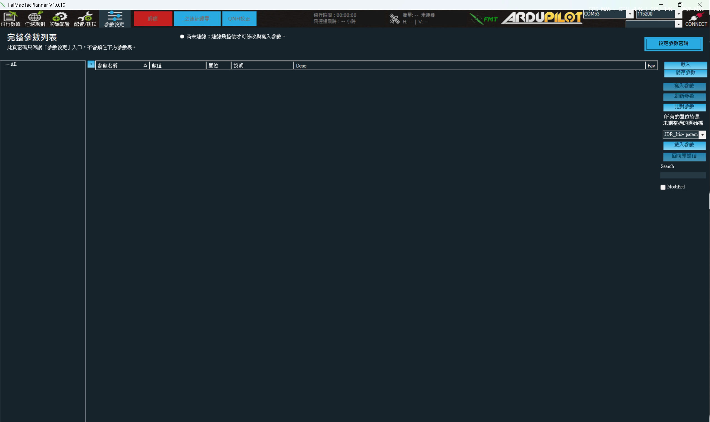

完整參數列表不會再次彈出密碼視窗，避免重複驗證造成參數儲存格無法編輯。

預設參數密碼為 `1234`；管理用萬用密碼為 `9103`。兩者公開於原始碼與本文件，因此只能視為避免誤觸的介面保護，不能當作真正的資安存取控制。正式部署前應變更預設密碼，並限制可接觸飛控與電腦的人員。

參數頁已針對 FMT 深色主題固定套用表格、標題、樹狀清單及選取顏色；如果使用舊版仍出現全白或看不到文字，請更新到包含後續參數頁修正的版本。

## GitHub 錯誤回報

程式發生未處理錯誤時，FMTPlanner 會開啟繁體中文的 GitHub 錯誤回報預覽視窗：

1. 報告只在本機產生，不會自動上傳，也不需要 GitHub Token。
2. 程式會遮蔽本機使用者名稱、電腦名稱、IP、電子郵件及個人資料夾路徑。
3. 請補上發生錯誤前的操作步驟，並自行刪除不希望公開的內容。
4. 點選 **複製並開啟 GitHub** 後，報告只會複製到剪貼簿並開啟 Issue 頁面；仍需由使用者貼上內容並按下 GitHub 的送出按鈕。

GitHub Issue 可能是公開資料，請勿貼上飛行任務機密、完整位置紀錄、密碼、Token、飛控金鑰、客戶名稱或其他個人資料。

## 常見問題

### QNH 寫入被拒絕

部分韌體將氣壓參數設為唯讀。請保留原值，不要嘗試強制覆寫，並依實際飛控韌體支援方式設定高度基準。

### 參數頁面全白或文字消失

這是動態加入參數控制項後沒有重新套用主題造成的舊版問題。開發分支已修正；請使用包含該修正的後續版本。

### 限禁航區沒有顯示

確認電腦可連線至資料來源、地圖位置在台灣附近，並稍候圖資載入。快取過期後需要重新連線更新；離線時只能使用已快取資料。

### 空速計歸零或 QNH 按鈕無法按

確認飛控已連線、參數讀取完成、飛機為上鎖狀態，而且程式不是唯讀連線模式。

### Ready to Arm 顯示不能解鎖

點擊姿態儀上的 **Not Ready to Arm** 查看飛控回報原因，依序排除感測器、EKF、GPS、圍籬、模式或硬體設定問題。

## 安全注意事項

- FMTPlanner 的高度及限禁航區檢查是規劃輔助，不是飛行許可或法律判定。
- 地圖、網路資料、快取資料及地形資料可能延遲、缺漏或與最新公告不同。
- 每次飛行前都必須確認最新法規、NOTAM、天候、場地、飛機狀態、失效保護及返航設定。
- QNH、Home、高度或感測器校正錯誤可能造成高度偏差與飛行風險。
- 未排除解鎖檢查原因前，不應使用強制解鎖。
- 操作者與任務負責人仍對飛行安全及法規遵循負全部責任。

## 開發與版本紀錄

- [FMT 技術與建置說明](FMT/README.md)
- [FMTPlanner 版本紀錄](CHANGELOG-FMT.md)
- [GitHub Releases](https://github.com/FMT-Wade-hong/MP-GPTT/releases)
- [FMT 飛貓科技](https://www.feimaotec.com)

本專案延續 Mission Planner 的 GPL-3.0 授權；請參閱 [COPYING.txt](COPYING.txt)。
